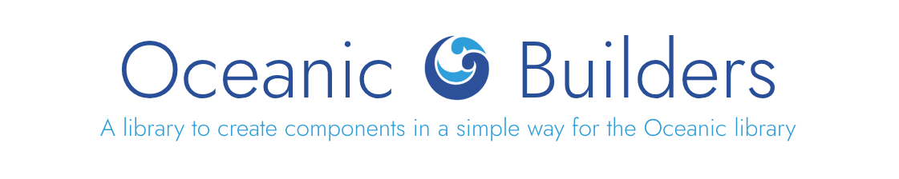

<div align="center">



[][OceanicBuildersNPMURL]
[][OceanicBuildersNPMURL]
[][SupportServerURL]

</div>

---

# 🌊 Oceanic Builders (Unofficial)

## ✨ Features

- ✅ Easy to use
- ✅ CJS and ESM support
- ✅ Support with objects and builders

## 📦 Installation

```bash
npm install oceanic-builders
```

## 📚 Documentation

You can see the complete documentation in our [GitHub repository][DocumentationFolderURL].

## 🛟 Support

If you need help or have any questions or issues, feel free to let us know on our [support server][SupportServerURL].

## 🚀 Basic Example

```js
import { ActionRow, Button } from "oceanic-builders";

const actionRow = new ActionRow()
  .addComponents([
    new Button().setCustomID("button").setLabel("Click me!").setStyle(2),
  ])
  .toJSON();

console.log(actionRow);
```

You can also see our [`example.ts`][ExamplesFileURL] file to see all the examples of all the components.

## 📄 License

This project is licensed under the [MIT License][MITLicenseURL].

[DocumentationFolderURL]: https://github.com/FancyStudioTeam/OceanicBuilders/tree/main/docs/builders
[ExamplesFileURL]: https://github.com/FancyStudioTeam/OceanicBuilders/blob/main/example.ts
[MITLicenseURL]: https://opensource.org/license/mit
[OceanicBuildersNPMURL]: https://www.npmjs.com/package/oceanic-builders
[SupportServerURL]: https://discord.gg/gud55BjNFC
